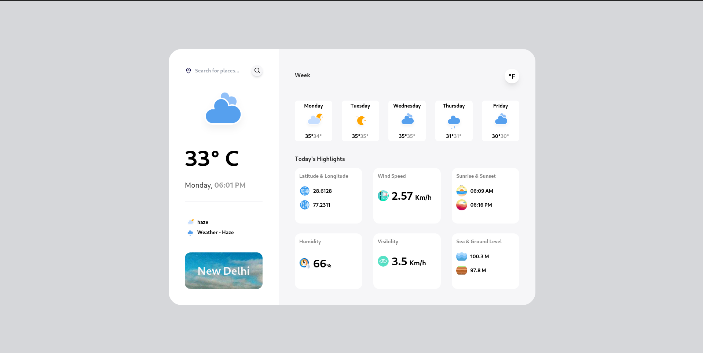

# Weather Forecast Application

This is a fully responsive web application built using Next.js and React that provides real-time weather updates and a 5-day forecast for any city in the world. The application fetches weather data from the OpenWeather API, allowing users to search for specific cities and switch between Celsius and Fahrenheit temperature units.

## Live Demo

**[Weather Forecast](https://weather-forecast-07.netlify.app/)**

## Features

- **Current Weather Status**: Displays real-time weather conditions for the searched city.
- **5-Day Weather Forecast**: Provides a detailed forecast for the next 5 days, including temperature and weather conditions.

- **Detailed Weather Data**: The current weather section includes:

  - Date and Local Time
  - Weather Description (e.g., clear sky, rainy)
  - Latitude & Longitude
  - Wind Speed
  - Sunrise & Sunset Times
  - Humidity Levels
  - Visibility Range
  - Sea Level and Ground Level Pressure

- **Search Functionality**: Search bar allows users to search for weather data in any city around the world.

- **Unit Toggle**: A button is available for switching between Celsius and Fahrenheit for temperature units.

## Tech Stack

- **[Next.js](https://nextjs.org/)**: Used for server-side rendering and improved performance.
- **[React](https://reactjs.org/)**: To build reusable components for the frontend.
- **[Axios](https://axios-http.com/)**: For making API calls to fetch weather data from OpenWeather API.
- **[OpenWeather API](https://openweathermap.org/api)**: Provides all the weather data used in the application.

## How to Run the Project

### Prerequisites

- Node.js and npm installed on your machine.
- An API key from [OpenWeather API](https://openweathermap.org/api).

### Installation

1. Clone this repository:

   ```bash
   git clone https://github.com/vishalkirtaniya/weather-forecast-application.git
   ```

2. Navigate to the project folder:

   ```bash
   cd weather-forecast-application
   ```

3. Install the dependencies:

   ```bash
   npm install
   ```

4. Create a `.env.local` file in the root of your project and add your OpenWeather API key:

   ```
   NEXT_PUBLIC_WEATHER_API_KEY=your_openweather_api_key
   ```

5. Run the development server:

   ```bash
   npm run dev
   ```

6. Open [http://localhost:3000](http://localhost:3000) to view it in your browser.

## Usage

1. Search for any city using the search bar to view its current weather and 5-day forecast.
2. View detailed weather information for the current day, including temperature, humidity, wind speed, and more.
3. Switch between Celsius and Fahrenheit units using the toggle button.

## Screenshots



## Acknowledgments

- [OpenWeather API](https://openweathermap.org/api) for providing weather data.
